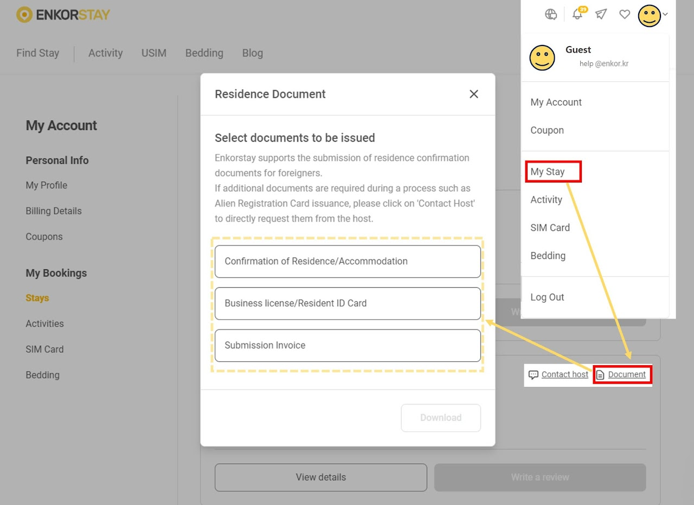

# Visa document support

Did you know that Enkor Stay conveniently supports **Visa/ARC documentation** for you? We provide documents that are typically required for Visa and Alien Registration Card processing.

Supported documents:

- Confirmation of acccomodation / residency
- Business license / resident ID card
- Invoice

### Download documents

1. Navigate to your [booking page](https://stay.enkor.kr/account/stay).
2. Locate the booking for which you want to request documents.
3. Click the **Document** button.
4. Select the type of document you want.



### Is it acceptable to submit the document received via email as it is?

If you have received a file identical to the image on the left, please make sure to fill in the area marked with the red box in the photo before submitting, as it is where the guest inputs information.


### Can you help me apply for an ARC?

It's possible! The documents we provide include the following:

- Confirmation of Residence/Accommodation
- Contract
- Receipt (or Invoice)
- Business Registration Certificate

We offer these documents as needed. If you require any of these documents, please try to download them via the 'My stay' menu.

### When can I request the necessary documents?

Documents other than the contract can be downloaded from 'My account.' Please refer to the explanation above.

### When will I receive the documents?

If the reservation holder matches the actual resident, you can download it from My Stay.

However, if the reservation holder and resident are different or if you have a roommate, please send us a message following the template below.

```bash
- Name:
- Reservation Number:
- Email address:
- Document Type:
```

The document types we can provide are as follows :

- Confirmation of residence
- Contract
- Invoice / Receipt

Contracts are usually sent within 2 weeks after reservation confirmation.
