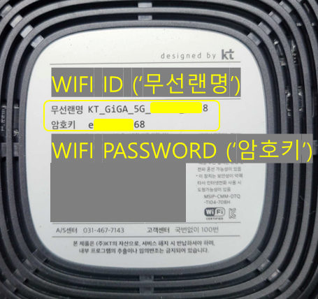

# Frequently asked questions

### Can I reserve this room?

If you set your desired location, dates, and number of guests on the homepage, you can check available locations for that period.

If there are rooms available for the dates you've set, you can send a reservation request right away.

Once you send the reservation request, the host will review it and either confirm or reject it.

### What amenities are provided?

It varies depending on the host and branch. However, most locations provide basic furniture and appliances, while other amenities may vary. Please **directly inquire** with the host for further details.

### Do you provide documents for ARC issuance?

Of course!

The list of documents we provide is as follows :

- Confirmation of Residence
- Invoice/Receipt
- Contract
- Business license

Except for the contract, other documents can be easily downloaded.

Please check the [document page](/articles/housing/documents)!

### Is smoking allowed?

🚭 Smoking indoors is strictly prohibited at all locations.

In the event of indoor smoking being detected, a fine may be imposed, so we kindly request your cooperation.

### Is it possible to live with pets?

We are a dog-loving company. Really. But bringing pets along is strictly prohibited.

We ask for your understanding.

### Are there any curfew hours?

There is no curfew.

However, in branches operated as co-living spaces, we kindly request that you be considerate during late hours by minimizing noise and being mindful of your housemates.

### Is it a male/female-only branch?

Private rooms have no gender restrictions.

However, please note that some branches operating as co-living branches may have gender-specific restrictions, so please check before making a reservation.

### Can I use Wi-Fi?

All locations have private Wi-Fi with highspeed broadband access. You can connect using the network information provided in the move-in guide or by checking the bottom or side of the router.

